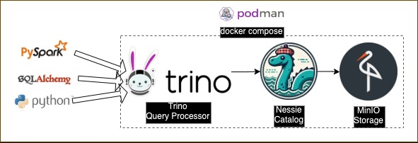
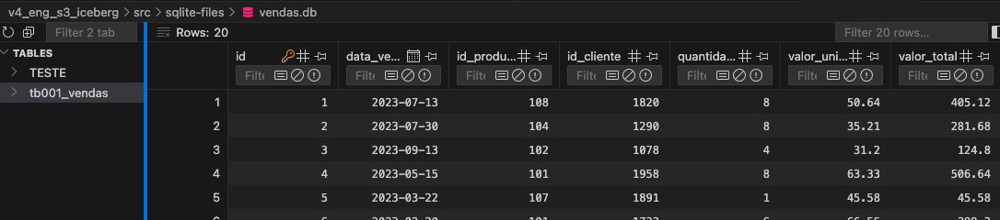
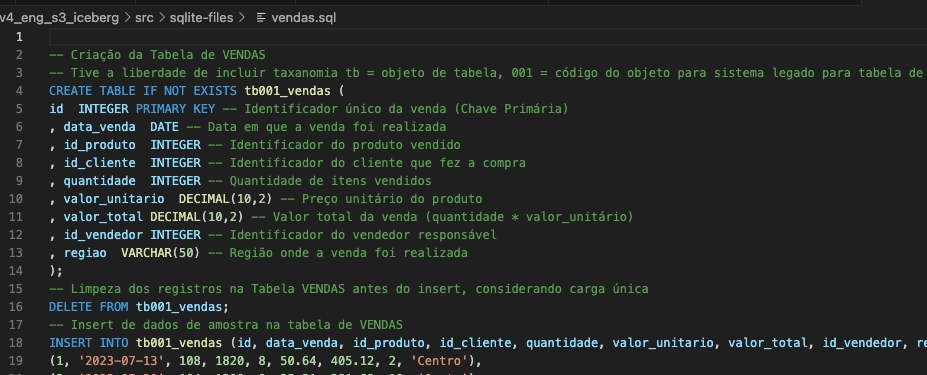
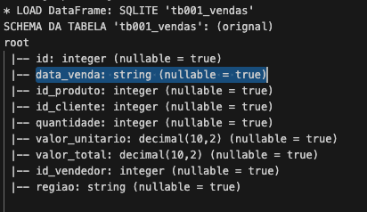
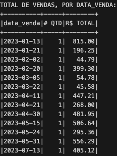
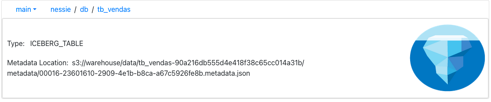
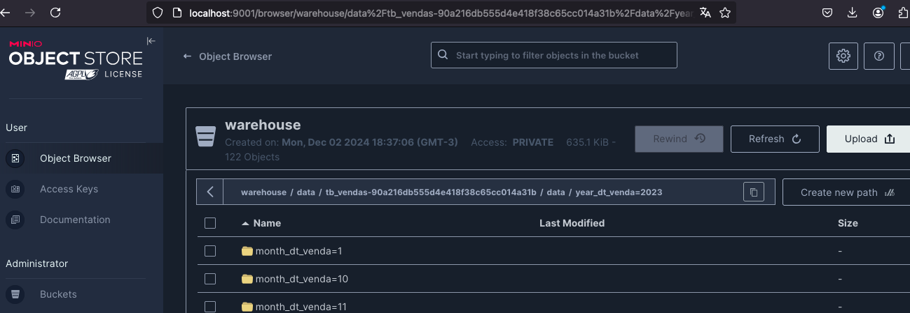
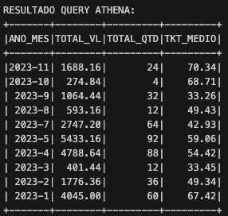

# ETL com Spark S3 Iceberg Local (MinIO+Nessie+Trino)
Nesse projeto foquei no consumo de dados no formato **S3 Iceberg** que é praticamente uma solução absoluta quando se trata de armazenamento e leitura em cenários de altíssimo volume de dados.
Entretando para economizar em pesquisa em desenvolvimento, temos hoje alternativas para "subir" S3 Iceberg localmente.
Claro que cada solução e ferramenta possuiram especificidades, ou seja, caracteristicas únicas que não serão identificas á plataforma da AWS, havendo até algums desvantagens. Mesmo assim,, vejo aqui já um grande avanço nesse sentido. Acredito que em breve, teremos ainda mais soluções OPEN SOURCE padronizadas (próximas) das soluções de mercado existentes.

- ##### Como instalar
  - Execue o arquivo docker-compose.yaml na raiz do projeto. No caso eu fiz uso do PODMAN _(com docker também funciona)_:
`podman-compose up`

  - Habilite o ambiente virtual do projeto do Python na raiz do projeto:
`source .venv/bin/activate`
  - Instale as biblitecas necessárias:
`pip install -r requirements.txt`
  - Execute o projeto python na pasta **src** somente após imagem do docker-compose estiver ativa.
`python src/etl_s3_iceberg.py`

- ##### Monitorando os serviços ativos
  - Trino: http://localhost:8080/
    _user: admin_
  - Nessie: http://localhost:19120
    _user: admin, password: password_
  - MinIO http://localhost:9001/
    _user: admin, password: password_

## Arquitetura da solução

Basicamente as plataformas que manipulam os dados se conectam com Trino. Esse por sua vez consegue habilita o acesso demócrático aos recursos do Nessie + MinIO que nos prove recurso do S3 Iceberg Localmente.

- #### MinIO
  MinIO é uma solução robusta de armazenamento de objetos compatível com o protocolo S3 da AWS. Ele é projetado para armazenar grandes quantidades de dados não estruturados, como arquivos de mídia, logs, backups e dados analíticos.
- #### Nessie
  Aqui temos uma solução de catálogo de dados que oferece versionamento para dados armazenados em data lakes e data warehouses auxiliando no armazenamento de arquivos no formato Iceberg.Permite criar branches e tags para dados, ajudando também visualização em relação a organização dos catalogos, schemas e tabelas.
- #### Trino
  Esse é meu preferido. Mecanisco de consulta de SQL distribuído, permite eecutar consultar em tempo real sobre diversas fontes de dados NoSQL, bastando apenas adiocionar novos catalogos para acessar novas origens.

#### Resumo do Conjunto
A reunião desses 3 principais componentes nos permite "simular" o consumo de ambiente de armazenamento e processamento distribuído localmente (com menos recursos).
No meu caso, por exemplo, minha máquina tinha apenas 8GB de RAM. E fui possivel realizar testes de menor escala para testar a tecnologia de processamento distribuído que geralmente exige um hardware mais pesado.

### Demais protagonistas
Sem duzir o prestigio do trio (MinIO+Nessie+Trino), nesse projeto fiz uso das biblitecas em Python: PySpark, PyTrino, SqlAlquemy. Elas executam a manipulação dos dados.
Outra solução que foi totalmente relevante para o desenvolvimento desse projeto foi o **PODMAN**. Ele é uma alernativa ao *DOCKER* para levantar imagens de *DOCKER* com menos recurso de máquina.
Claro que existe diferença de arquitetura entre PODMANxDOCKER, porém, para desenvolvimento local, percebi muita vantagem no uso **PODMAN** como falei minha máquina tem apenas 8GB. 

# Entregas do Objetivo
##### 1. Uso dados de um banco de dados SQLITE
  
  Arquivo SQL de produção SQLITE
  `v4_eng_s3_iceberg/src/sqlite-files/vendas.sql`
  
  No PySpark foi preciso fazer uso de JDBC próprio para o SQlite, disponível em: https://github.com/xerial/sqlite-jdbc/releases
    > spark = SparkSession.builder\
    .config("spark.log.level", "ERROR")\
    .config("spark.jars", f"{SQLITE_JDBC}")\
    .appName("SQLITE_SPARK")\
    .getOrCreate()<

   Script de carregamento dos dados, foi preciso colocar `customSchema` para tratar a coluna de `data_venda`.
   > df_bronze = spark.read\
    .format('jdbc')\
    .option("customSchema", "id INTEGER, data_venda STRING, id_produto INTEGER, id_cliente INTEGER, quantidade INTEGER, valor_unitario DECIMAL(10,2), valor_total DECIMAL(10,2), id_vendedor INTEGER, regiao VARCHAR(50)")\
    .options(driver="org.sqlite.JDBC", dbtable=TB_VENDAS, url=f"jdbc:sqlite:{SRC_DIR}/sqlite-files/vendas.db")\
    .load() 

##### 2. Tratar campo de data, total vendas por dia e remoção de duplicados
a) Tratando campo de data_venda:
| antes | depois |
| ----- | ------ |
||  |
| data_venda tipo string | data_venda tipo date |

Script para tratamento da coluna data_venda:
>df_prata = df_bronze.withColumn("data_venda", F.to_date("data_venda", "yyyy-MM-dd"))

b) Relatório total de vendas por dia:

Script para geração do relatório:
> (df_prata
    .groupBy("data_venda")
    .agg(F.count("*").alias("# QTD"), F.sum("valor_total").alias("R$ TOTAL"))
    .orderBy("data_venda")
    .show())

c) Script para remoção de duplicados:
> df_prata = df_prata.dropDuplicates(['id'])

##### 3. Carregamento dos dados para S3 Iceberg

`http://localhost:19120/content/main/db/tb_vendas`
No Nessie conseguir visualizar claramente o catalogo utlizado e formado S3 Iceberg.

No MinIO visulizamos claramente a distribuição da partição dos arquivos em ANO, MÊS e DIA.
Foram criadas duas funcões para "simular" essa ação:
`BulkInsertTRINO()` que realiza o insert do dado no formato S3 Iceberg Parquet, por batch, para gerenciar perfomance de infra.
`list_to_sqlvalues` que recebe o dado bruto e o trata para prevenir eventutais problemas que o formato PARQUET exige.
> CREATE TABLE IF NOT EXISTS iceberg.db.tb_vendas (
	dt_processamento DATE,
	year_dt_venda INTEGER NOT NULL,
	month_dt_venda INTEGER NOT NULL,
	day_dt_venda INTEGER NOT NULL,
	id INTEGER NOT NULL, 
	data_venda DATE NOT NULL, 
	id_produto INTEGER NOT NULL, 
	id_cliente INTEGER NOT NULL, 
	quantidade INTEGER NOT NULL, 
	valor_unitario DECIMAL(10,2), 
	valor_total DECIMAL(10,2), 
	id_vendedor INTEGER NOT NULL, 
	regiao VARCHAR(50)
)
WITH (
	format = 'PARQUET',
 	partitioning=ARRAY['year_dt_venda','month_dt_venda','day_dt_venda'],
	sorted_by = ARRAY['year_dt_venda','month_dt_venda','day_dt_venda']
)

O Particionamento da tabela acontece na criação da tabela. No caso precisei fazer uso de um artificio técnico para reproduzir o particionamento por ANO, MÊS e DIA. Criando 3 colunas a mais fazendo uso especificamente delas para deixar a participação no formato desejado. 
No S3 AWS esse artificio é desnecessário, lá é possivel realizar essa indexação com apenas uma coluna de data.

##### 4. TOTAL DE VENDA POR MÊS (query S3 Athena)

> WITH cte AS (
    SELECT 
        year_dt_venda
        ,month_dt_venda
        ,valor_total, quantidade
    FROM iceberg.db.tb_vendas
)
SELECT
    CONCAT(CAST(year_dt_venda as varchar),'-',CAST(month_dt_venda as varchar)) AS ano_mes
    ,SUM(valor_total) AS total_vl
    ,SUM(quantidade) AS total_qtd
    ,SUM(valor_total)/SUM(quantidade) AS tkt_medio
FROM cte
GROUP BY year_dt_venda, month_dt_venda
ORDER BY year_dt_venda desc, month_dt_venda desc

O AWS Athena realiza a cobrança pela transferencia do dado de saída. Logo fazer do `WITH cte AS(` para higienizar o dado antes da saída final é uma boa prática que pode trazer economia para os processos.

##### 5. Visualização
[Metabase]

## Conclusão
Como nem tudo são flores... Não foi possível conectar o SPARK diretamente ao NESSIE+MINIO (o que traria maior performance). Embora exista documentação na página dos desenvolvedore, depois de muitos testes *(acredite!)*. Concluí que até pode ser uma possíbilidade, entretanto no ambiente local com praticamente 1 core executando em cada aplicação e poquissíma mémoria não foi possivel os demais experimentar cenários com hardware mais potente.